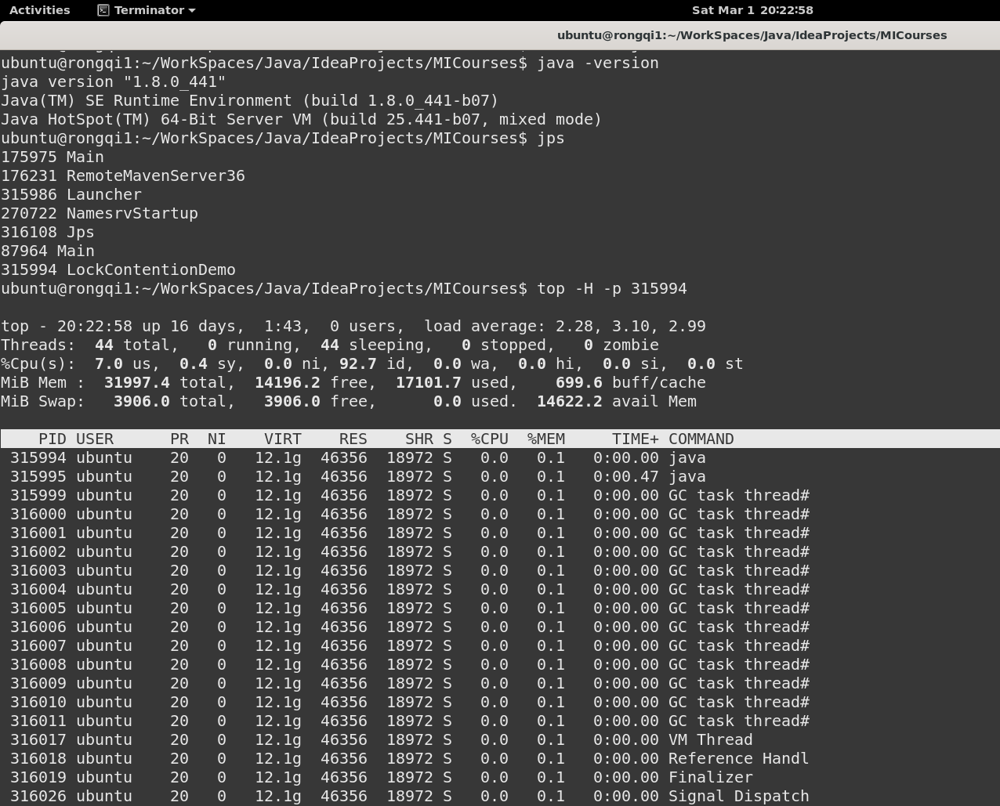
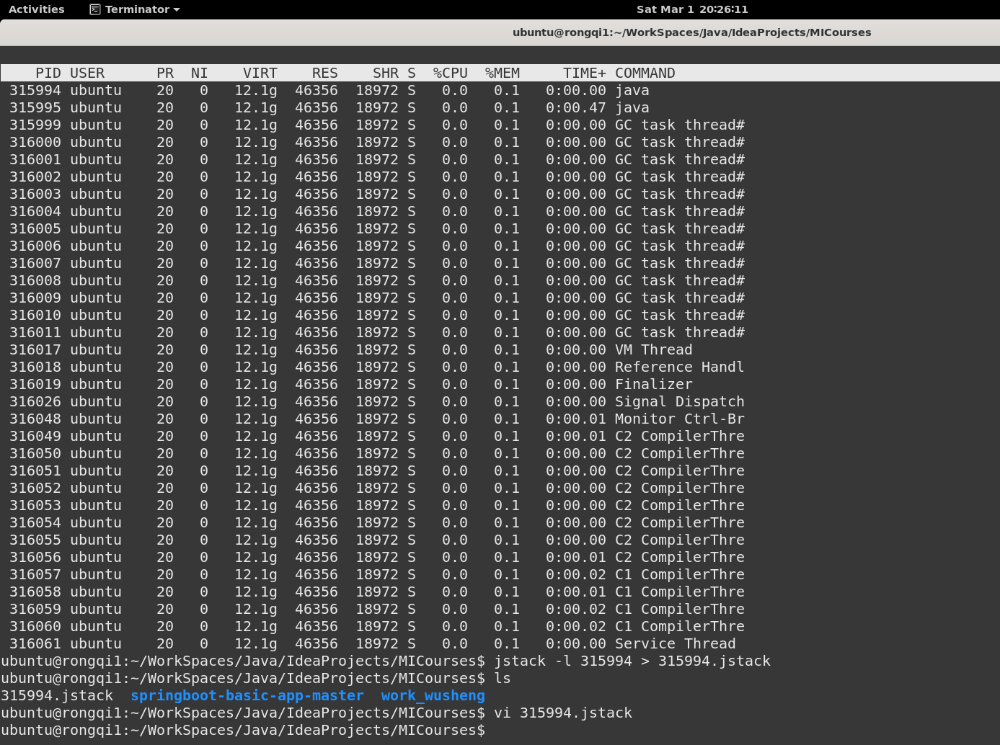
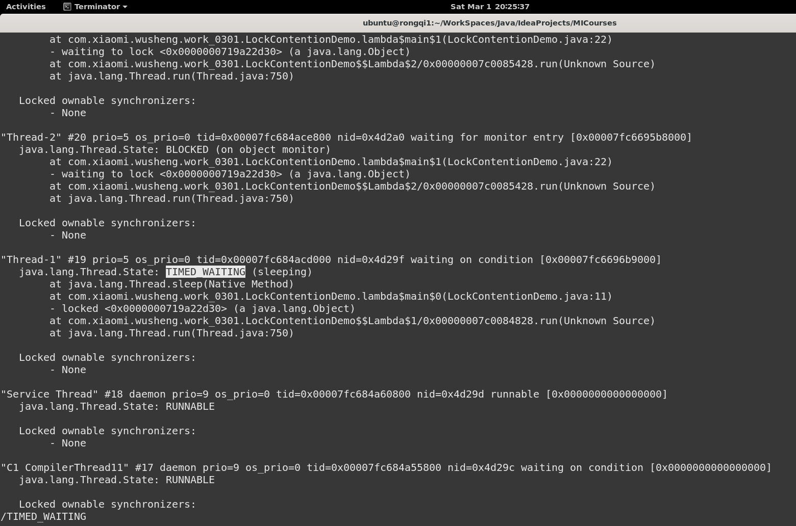

# 3月1日

# 问题1

> 设计一个Java程序，复现CPU利用率不高，但是运行很慢的情况，并使用jstack工具排查。请描述使用jstack工具排查的步骤，并解释每一步的作用，说明什么场景下会出现这种情况。
> 

# 程序设计：

```java
/*
程序启动一个线程持有一个共享锁，并进入长时间睡眠。
同时启动多个线程不断尝试获取该锁，这些线程一直处于阻塞状态，
最终导致程序整体运行缓慢，而CPU利用率低。
*/
package com.xiaomi.wusheng.work_0301.question_1;

public class LockContentionDemo {
    private static final Object lock = new Object();

    public static void main(String[] args) {
        new Thread(() -> {
            synchronized(lock){
                try {
                    System.out.println("Thread-1 获取锁");
                    Thread.sleep(600_000); // 模拟持有锁后执行耗时I/O操作
                } catch (InterruptedException e) {
                    e.printStackTrace();
                }
            }
        }, "Thread-1").start();

        for(int i = 2; i <= 10; i++){
            Thread newThread = new Thread(() -> {
                while (true) {
                    synchronized (lock) {
                        System.out.println(Thread.currentThread().getName() + "获取锁");
                    }
                    try {
                        Thread.sleep(1000);
                    } catch (InterruptedException e) {
                        e.printStackTrace();
                    }
                }
            }, "Thread-" + i);
            newThread.start();
        }
    }
}

```

# 排查方法



```bash
  jps
```

- 作用：列出当前系统中所有Java进程的PID和主类名称（如输出中的 315994 LockContentionDemo），便于后续分析。

```bash
  top -H -p 315994
```

- 作用：查看目标进程的线程级CPU占用（在Ubuntu系统，如图所示）
- CPU使用率分析：
    - 用户空间（us）：7.0%，应用程序代码占用CPU较低。
    - 系统空间（sy）：0.4%，内核操作（如中断、上下文切换）消耗较少。
    - 空闲（id）：92.7%，CPU大部分时间处于空闲状态。
- 潜在问题： 低CPU利用率但高负载，说明系统可能存在I/O等待或锁竞争，线程因等待外部资源（如数据库响应、网络I/O）而阻塞，导致CPU空闲但任务堆积。



```bash
  jstack -l 315994 > 315994.jstack
```

- 作用：捕获JVM中所有线程的完整快照，包括线程状态、锁持有情况、调用栈信息。

```bash
  vi 315994.jstack
```

- 作用：打开生成的 .stack 文件并进行分析，可以看到 **Thread-2** 到 **Thread-10** 都在等待锁（waiting to lock <0x0000000719a22d30>），因尝试获取同一把锁（锁竞争）而阻塞，处于**BLOCKED**状态，。**Thread-1**处于**TIMED_WAITING**状态，长期持有锁，导致锁未被释放，进而导致CPU利用率不高，但是运行很慢。




# 典型发生场景

1. 同步资源滥用。在synchronized块内执行耗时操作（如：数据库查询、文件IO），比如在支付系统中同步处理日志写入。
2. 线程池配置不当。数据库连接池过小导致大量请求排队，比如电商大促时订单服务线程池满。
3. 第三方服务依赖。外部API响应缓慢导致线程阻塞，比如调用银行支付网关时网络延迟。
4. 不合理的锁设计。使用对象级锁替代更细粒度的锁，比如全局缓存使用synchronizedMap替代ConcurrentHashMap。