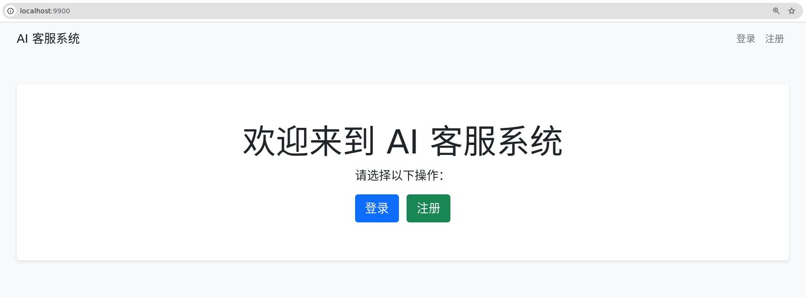
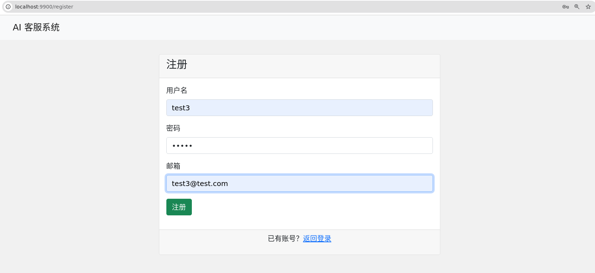
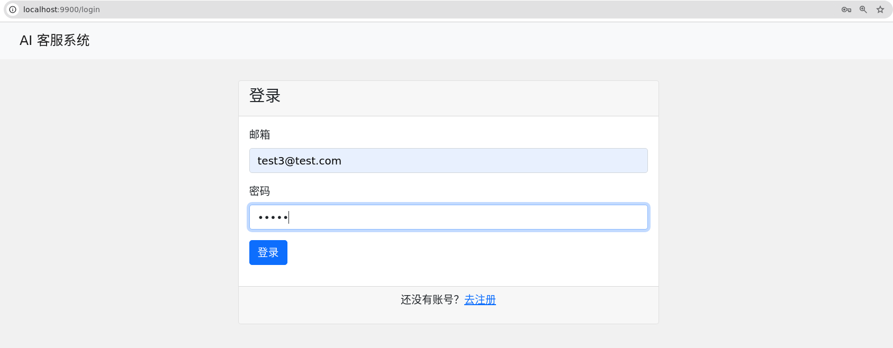
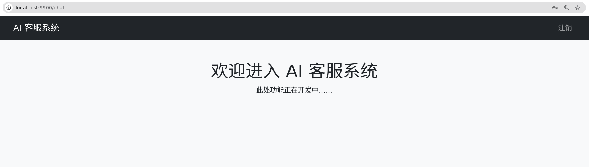

# 3月3日 技术方案文档

> 第一天：
> 
> 
> 一、熟悉项目要求，根据项目功能要求完成项目架构设计（已完成）
> 
> 二、完成项目搭建，使用Demo页面完成登录、注册功能开发（已完成）
> 
> 三、使用Java8新特性、数据库连接池等技术（已完成）
> 
> 四、完成调试、测试，各个功能正常（已完成）
> 
> 五、整理技术方案（已完成）
> 

# 项目环境

- Ubuntu 20.04.6 LTS
- JDK 1.8
- Maven 3.9.9
- IntelliJ IDEA Community Edition
- MySQL 8.0.41

# 项目架构设计（初步设计）

- 前端：基于 Thymeleaf 和 Bootstrap 构建静态页面（index、login、register、chat）
- 后端：Spring Boot 应用提供 RESTful 接口（用户注册、登录），并负责业务逻辑处理
- 数据库：MySQL 数据库存储用户信息等数据，采用 Druid 数据库连接池管理
- 安全：Spring Security 实现 RESTful 认证，使用 BCrypt 进行密码加密

# 使用Maven搭建项目（初步设计文件结构）

```markdown
project_wusheng
├── pom.xml
├── src
│   ├── main
│   │   ├── java
│   │   │   └── com
│   │   │       └── xiaomi
│   │   │           └── wusheng
│   │   │               └── work_0303
│   │   │                   ├── Application.java
│   │   │                   ├── config
│   │   │                   │   └── SecurityConfig.java // 安全配置类
│   │   │                   ├── controller
│   │   │                   │   ├── HomeController.java // 主页控制器
│   │   │                   │   └── UserController.java // 用户控制器
│   │   │                   ├── dao
│   │   │                   │   └── UserMapper.java // MyBatis Mapper接口，用于数据库操作
│   │   │                   ├── model
│   │   │                   │   └── User.java // 用户实体类，映射数据库表
│   │   │                   ├── service
│   │   │                   │   ├── impl
│   │   │                   │   │   └── UserServiceImpl.java // 用户服务实现类
│   │   │                   │   └── UserService.java // 用户服务接口
│   │   │                   └── utils
│   │   └── resources
│   │       ├── application-dev.yml
│   │       ├── application.yml
│   │       └── templates
│   │           ├── chat.html // 聊天页面
│   │           ├── index.html // 首页
│   │           ├── login.html // 登录页面
│   │           └── register.html // 注册页面
```

# 数据库内新建数据表

```sql

CREATE DATABASE aisystem;

GRANT ALL PRIVILEGES oN aisystem.* To shawn@'%' WITH GRANT OPTION;
FLUSH PRIVILEGES;

USE aisystem;

-- 用户表
CREATE TABLE users (
    userId BIGINT AUTO_INCREMENT PRIMARY KEY,
    userName VARCHAR(50) NOT NULL UNIQUE COMMENT '用户名',
    password VARCHAR(255) NOT NULL COMMENT '加密后的密码',
    email VARCHAR(100) DEFAULT NULL COMMENT '用户邮箱',
    status TINYINT DEFAULT 1 COMMENT '账号状态：1 正常，0 禁用',
    createTime TIMESTAMP DEFAULT CURRENT_TIMESTAMP COMMENT '创建时间',
    updateTime TIMESTAMP DEFAULT CURRENT_TIMESTAMP ON UPDATE CURRENT_TIMESTAMP COMMENT '最后更新时间'
) ENGINE=InnoDB DEFAULT CHARSET=utf8mb4;
	
```

# 项目功能设计

### pom.xml（导入相关依赖）

```xml

    <parent>
        <groupId>org.springframework.boot</groupId>
        <artifactId>spring-boot-starter-parent</artifactId>
        <version>2.7.18</version>
    </parent>

    <dependencies>

        <!-- Spring Boot Starter Web -->
        <dependency>
            <groupId>org.springframework.boot</groupId>
            <artifactId>spring-boot-starter-web</artifactId>
        </dependency>

        <!-- Spring Boot Starter Thymeleaf -->
        <dependency>
            <groupId>org.springframework.boot</groupId>
            <artifactId>spring-boot-starter-thymeleaf</artifactId>
        </dependency>

        <!-- MyBatis Spring Boot Starter -->
        <dependency>
            <groupId>org.mybatis.spring.boot</groupId>
            <artifactId>mybatis-spring-boot-starter</artifactId>
            <version>2.2.2</version>
        </dependency>

        <!-- Druid 连接池 -->
        <dependency>
            <groupId>com.alibaba</groupId>
            <artifactId>druid-spring-boot-starter</artifactId>
            <version>1.2.16</version>
        </dependency>

        <!-- MySQL connector -->
        <dependency>
            <groupId>com.mysql</groupId>
            <artifactId>mysql-connector-j</artifactId>
        </dependency>

        <dependency>
            <groupId>org.projectlombok</groupId>
            <artifactId>lombok</artifactId>
            <scope>provided</scope>
        </dependency>

        <dependency>
            <groupId>org.springframework.boot</groupId>
            <artifactId>spring-boot-starter-security</artifactId>
        </dependency>
    </dependencies>
       
```

### model/User.java

```java

public class User {
    private Long userId;
    private String userName;
    private String password;
    private String email;
    private Byte status;
    private LocalDateTime createTime;
    private LocalDateTime updateTime;
```

- 映射数据库中 users 表的记录

### dao/UserMapper.java

```java

    @Insert("INSERT INTO users(userName, password, email, status) VALUES(#{userName}, #{password}, #{email}, #{status})")
    @Options(useGeneratedKeys = true, keyProperty = "userId")
    int insertUser(User user);

    @Select("SELECT * FROM users WHERE userName = #{userName}")
    User selectByUserName(String userName);

    @Select("SELECT * FROM users WHERE email = #{email}")
    User selectByEmail(String email);

    // 登录时使用邮箱查询
    @Select("SELECT * FROM users WHERE email = #{email}")
    User selectByLoginEmail(String email);

    // 更新用户登录时间，使用数据库的 CURRENT_TIMESTAMP
    @Update("UPDATE users SET updateTime = CURRENT_TIMESTAMP WHERE userId = #{userId}")
    int updateLoginTime(Long userId);
```

- 使用MyBatis 的 Mapper 接口，执行数据库操作，实现用户注册时的插入、查询昵称和邮箱、登录时根据邮箱查询，以及登录成功后更新用户登录时间

### service/UserService.java

```java

public interface UserService {
    boolean register(User user);
    User login(String email, String password);
}
```

- 定义用户服务接口，有注册和登录两个方法

### service/impl/UserServiceImpl.java

```java

    @Override
    public boolean register(User user) {
        // 检查昵称是否已存在
        Optional<User> existingName = Optional.ofNullable(userMapper.selectByUserName(user.getUserName()));
        if(existingName.isPresent()){
            return false; // 昵称已存在
        }
        // 检查邮箱是否已注册
        Optional<User> existingEmail = Optional.ofNullable(userMapper.selectByEmail(user.getEmail()));
        if(existingEmail.isPresent()){
            return false; // 邮箱已存在
        }
        // 使用 BCrypt 加密密码
        user.setPassword(passwordEncoder.encode(user.getPassword()));
        // 设置默认状态 1（正常）
        user.setStatus((byte) 1);
        return userMapper.insertUser(user) > 0;
    }

    @Override
    public User login(String email, String password) {
        // 根据邮箱查询用户
        User user = userMapper.selectByLoginEmail(email);
        if(user != null && passwordEncoder.matches(password, user.getPassword())){
            // 登录成功后，更新登录时间
            userMapper.updateLoginTime(user.getUserId());
            return user;
        }
        return null;
    }
```

- 负责用户注册和登录的业务逻辑
- 使用Optional.ofNullable()判断昵称和邮箱是否已存在，如果存在则返回 false，表示注册失败
- 如果昵称和邮箱都不存在，则对密码进行加密，状态设置为 1，并插入记录，返回值大于 0 则注册成功
- 通过邮箱查询用户是否存在，存在则检查密码，并在登录成功后更新登录时间

### controller/UserController.java

```java

    @Autowired
    private UserService userService;

    // 注册接口
    @PostMapping("/register")
    public ResponseEntity<?> register(@RequestBody User user) {
        boolean success = userService.register(user);
        if (success) {
            return ResponseEntity.ok("Registration successful");
        } else {
            return ResponseEntity.badRequest().body("Nickname or email already exists or registration failed");
        }
    }

    // 使用邮箱和密码进行登录
    @PostMapping("/login")
    public ResponseEntity<?> login(@RequestBody User loginRequest, HttpServletRequest request) {
        User user = userService.login(loginRequest.getEmail(), loginRequest.getPassword());
        if (user != null) {
            UsernamePasswordAuthenticationToken authentication =
                    new UsernamePasswordAuthenticationToken(user.getEmail(), null, Collections.emptyList());
            SecurityContextHolder.getContext().setAuthentication(authentication);
            request.getSession().setAttribute("SPRING_SECURITY_CONTEXT", SecurityContextHolder.getContext());
            user.setPassword(null);
            return ResponseEntity.ok(user);
        } else {
            return ResponseEntity.badRequest().body("Invalid email or password");
        }
    }
```

- 注册成功或者失败都会返回对应的提示
- 使用邮箱和密码登录，邮箱信息存入 UsernamePasswordAuthenticationToken，认证信息存入 SecurityContext，并在返回用户信息时，移除密码字段进行保密

### controller/HomeController.java

```java

// 页面跳转控制
@Controller
public class HomeController {

    @GetMapping("/")
    public String index() {
        return "index";  // 返回 index.html
    }

    @GetMapping("/login")
    public String login() {
        return "login";  // 返回 login.html
    }

    @GetMapping("/register")
    public String register() {
        return "register";  // 返回 register.html
    }

    @GetMapping("/chat")
    public String chat() {
        return "chat";  // 返回 chat.html
    }
}
```

- 用于处理页面跳转请求

### config/SecurityConfig.java

```java

    @Bean
    public PasswordEncoder passwordEncoder() {
        return new BCryptPasswordEncoder();
    }

    @Bean
    public SecurityFilterChain securityFilterChain(HttpSecurity http) throws Exception {
        http
                .csrf().disable()
                .authorizeRequests()
                .antMatchers("/", "/index.html", "/register", "/login", "/api/users/register", "/api/users/login") //无需身份验证即可访问
                .permitAll()
                .anyRequest().authenticated() //其他所有请求都需要身份认证后才能访问
                .and()
                .formLogin().disable()
                .logout().permitAll(); // 允许所有用户访问注销接口
        return http.build();
    }
```

- 在项目中所有需要进行密码加密和比对的地方，都可以通过依赖注入使用该 Bean，从而确保用户密码安全存储
- 允许用户直接访问首页、登录、注册页面和相关 RESTful 接口，而其他路径则要求用户必须已认证

# 结果展示

## index.html



## register.html



## login.html



## chat.html

